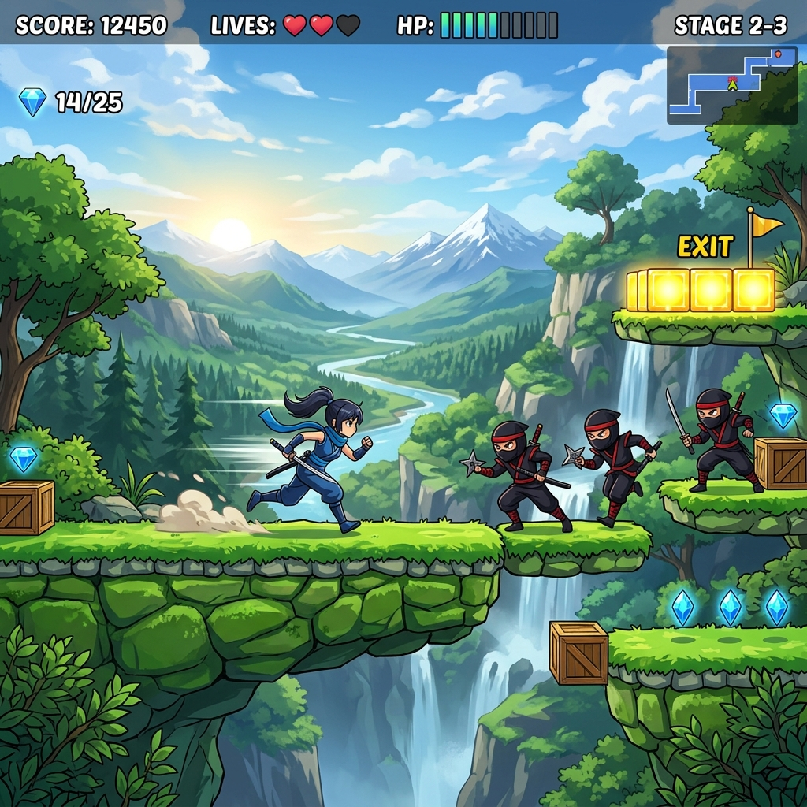

# Ninja Platformer 🥷

A 2D platforming adventure game built with Python and Pygame! Select your unique Ninja Duo, jump across dangerous platforms, dodge deadly lava pits, and stomp on evil enemy ninjas to reach the goal.



## Features 🎮
- **32 Unique Duos**: Choose from a massive roster of ninja teams, each with their own names and elements.
- **Dynamic Elements**: Your ninja's outfit dynamically changes color depending on the element you choose!
- **15 Levels of Gameplay**: Features handcrafted, carefully designed stages that gradually increase in difficulty, plus procedurally generated stages for an endless challenge.
- **Combat & Hazards**: Master your jump timing to clear massive gaps, avoid falling into the deadly red lava blocks, and stomp on the heads of the dark ninja enemies to defeat them!

## How to Play 🕹️
1. Run the game from the source directory:
```bash
python src/main.py
```
2. On the menu screen, press `SPACE` to start.
3. Use the **Prev**, **Next**, or **Randomize** buttons to browse the roster. Click **Start Mission** to begin.
4. **Controls**:
   - **Left / Right Arrow Keys**: Move horizontally
   - **Up Arrow**: Jump
   - **R**: Restart the game when you hit a Game Over or Win screen

## Installation 🛠️
Ensure you have Python 3 installed. Then, install the required dependencies:

```bash
pip install -r requirements.txt
```

*(Note: Pygame is required to run the game)*
